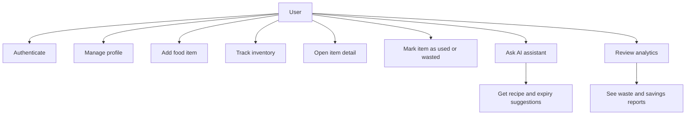
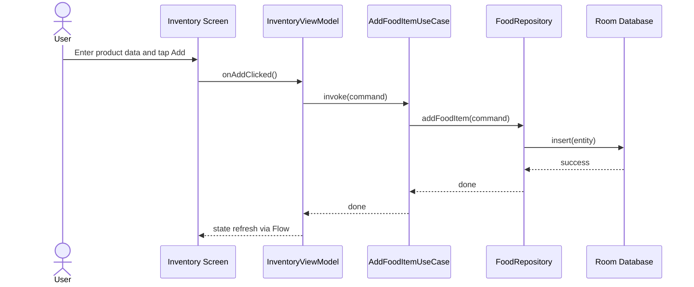
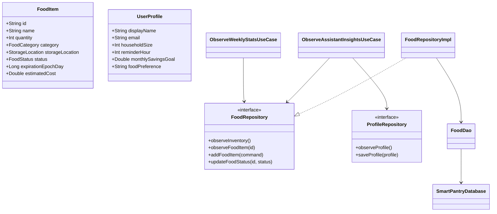
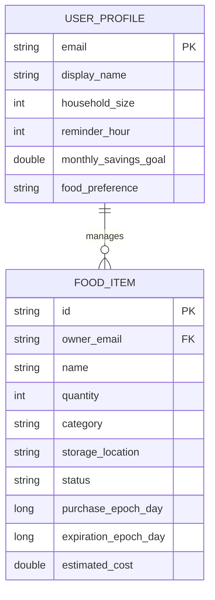

# Architecture Diagrams

## Use-case diagram

```mermaid
flowchart TD
    User["User"] --> Auth["Authenticate"]
    User --> Profile["Manage profile"]
    User --> Add["Add food item"]
    User --> Track["Track inventory"]
    User --> Detail["Open item detail"]
    User --> Status["Mark item as used or wasted"]
    User --> Assist["Ask AI assistant"]
    User --> Analytics["Review analytics"]

    Assist --> Suggest["Get recipe and expiry suggestions"]
    Analytics --> Reports["See waste and savings reports"]
```

## Sequence diagram

```mermaid
sequenceDiagram
    actor User
    participant UI as Inventory Screen
    participant VM as InventoryViewModel
    participant UC as AddFoodItemUseCase
    participant Repo as FoodRepository
    participant DB as Room Database

    User->>UI: Enter product data and tap Add
    UI->>VM: onAddClicked()
    VM->>UC: invoke(command)
    UC->>Repo: addFoodItem(command)
    Repo->>DB: insert(entity)
    DB-->>Repo: success
    Repo-->>UC: done
    UC-->>VM: done
    VM-->>UI: state refresh via Flow
```

## Class diagram

```mermaid
classDiagram
    class FoodItem {
      +String id
      +String name
      +Int quantity
      +FoodCategory category
      +StorageLocation storageLocation
      +FoodStatus status
      +Long expirationEpochDay
      +Double estimatedCost
    }

    class UserProfile {
      +String displayName
      +String email
      +Int householdSize
      +Int reminderHour
      +Double monthlySavingsGoal
      +String foodPreference
    }

    class FoodRepository {
      <<interface>>
      +observeInventory()
      +observeFoodItem(id)
      +addFoodItem(command)
      +updateFoodStatus(id, status)
    }

    class ProfileRepository {
      <<interface>>
      +observeProfile()
      +saveProfile(profile)
    }

    class FoodRepositoryImpl
    class FoodDao
    class SmartPantryDatabase
    class ObserveAssistantInsightsUseCase
    class ObserveWeeklyStatsUseCase

    FoodRepositoryImpl ..|> FoodRepository
    FoodRepositoryImpl --> FoodDao
    FoodDao --> SmartPantryDatabase
    ObserveAssistantInsightsUseCase --> FoodRepository
    ObserveAssistantInsightsUseCase --> ProfileRepository
    ObserveWeeklyStatsUseCase --> FoodRepository
```

## ER diagram

```mermaid
erDiagram
    USER_PROFILE ||--o{ FOOD_ITEM : manages

    USER_PROFILE {
        string email PK
        string display_name
        int household_size
        int reminder_hour
        double monthly_savings_goal
        string food_preference
    }

    FOOD_ITEM {
        string id PK
        string owner_email FK
        string name
        int quantity
        string category
        string storage_location
        string status
        long purchase_epoch_day
        long expiration_epoch_day
        double estimated_cost
    }
```
